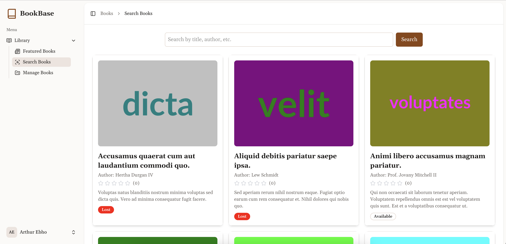
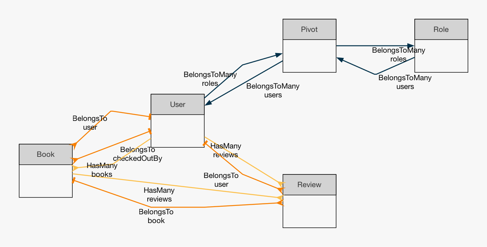

# BookBase - Library Management App

BookBase is a modern full-stack library management application built with Laravel and Vue 3. It offers a seamless user experience with responsive design, dark mode, Tailwind CSS styling, and comprehensive book management features. The application includes robust backend functionality, a RESTful API, and a polished Vue 3 frontend with full testing support using PHPUnit.

## Demo

[View the Demo](http://137.184.103.55)

### Screenshot


### Database Diagram


## Features

### Frontend (Vue 3)

- **Dark Mode Toggle:** Easily switch between light and dark themes.
- **Book Catalogue:**
    - Display a dynamic grid of books with cover image, title, author, description, and average user rating.
    - Pagination, filtering, and sorting by Title, Author, and Availability.
- **Book Details:**
    - Detailed view with checkout, review submission, and state transitions.
- **Responsive & Accessible:**
    - Designed to work flawlessly on mobile and desktop with smooth transitions.
- **Reusable Components:**
    - Modular components including BookCard, filter panels, and modals.
- **Testing:**
    - Comprehensive tests using PHPUnit.

### Backend (Laravel)

- **RESTful API Endpoints:**
    - Manage books: create, read, update, delete.
    - Checkout and state transitions for books.
    - Fulltext search support (with fallback on SQLite during tests).
- **Eloquent Models & Factories:**
    - Efficient management and seeding of book data.
- **Validation & Policies:**
    - Request validation via Form Requests and role-based access control for librarians.
- **Automatic Return & Scheduled Jobs:**
    - Automatically mark overdue books as available and notify users.
- **API Resources:**
    - Consistent JSON responses for seamless frontend integration.

### Testing

- **Laravel Tests:**
    - PHPUnit tests for API endpoints and business logic.

## Installation

### Requirements

- PHP 8.0+
- Composer
- Node.js & Yarn (or npm)
- MySQL or an alternative database (SQLite for testing)
- Laravel 12

## Setup Options

### Local Environment

1. **Clone the Repository:**
   ```sh
   git clone https://github.com/arthureb-dev/bookbase.git
   cd bookbase

2. Install PHP dependencies:
    ```sh
    composer install
    ```
3. Install Node.js dependencies:
    ```sh
    npm install
    ```
4. Copy the environment file and generate the app key:
    ```sh
    cp .env.example .env
    php artisan key:generate
    ```
5. Run migrations:
    ```sh
    php artisan migrate --seed
    ```
6. Start the Laravel server:
    ```sh
    php artisan serve
    ```
7. Start the Vite development server:
    ```sh
    npm run dev
    ```
8. Access the application:
    ```sh
    Laravel Backend: http://127.0.0.1:8000
    Vue development server: http://localhost:5173
    ```
9. Link storage
   ``` sh
   php artisan storage:link
      
## Testing

```sh
    php artisan test
